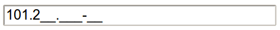
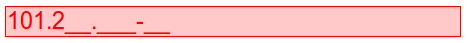
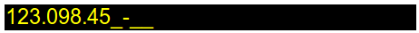

# cadMask

### The CPF/CNPJ Plugin

(**pt_BR**) Este plugin ativa a máscara de um input to tipo text que aceita CPF e CNPJ ao mesmo tempo.
Exibe a máscara pertinente no momento (caso tenha menos que 12 caracteres, exibe máscara de CPF).
Não aceita nenhum caractere que não seja um dígito numérico.

### Opções

* **cpfMask**: formato da máscara do CPF. Use o caracter "\_" como substituto do dígito. (padrão: \_\_\_.\_\_\_.\_\_\_-\_\_)
* **cnpjMask**: formato da máscara do CNPJ. Use o caracter "\_" como substituto do dígito. (padrão: \_\_\_.\_\_\_.\_\_\_\\\_\_\_\_-\_\_)
* **hasRawField**: configura se o campo envia o valor no formato cru, sem os pontos e traços (ex.: 111.111.111-11 => raw: 11111111111). (padrão: false)
* **rawName**: o nome do campo cru a ser enviado (ver **hasRawField**). (padrão: "raw")
* **rawId**: o id do campo cru a ser enviado (ver **hasRawField**). (padrão: "raw_id")
* **showError**: configura se o campo irá denotar um erro mudando seu estilo CSS. (padrão: false)
* **errorStyle**: configura a classe CSS para ser usada quando tiver um erro no campo. (padrão: null)
* **cpfCallback**: especifica a função para validar o CPF.
                   Por padrão, o plugin já verifica se o campo tem 11 ou 15 caracteres (CPF ou CNPJ, respectivamente).
                   A função deve retornar verdadeiro para passar.
                   A funcão recebe o próprio elemento DOM onde é aplicado a máscara como parâmetro no formato jQuery.
                   (padrão: function () { return true; })
* **cnpjCallback**: especifica a função para validar o CNPJ (ver **cpfCallback**).

### Exemplo de Uso

    // uso simples
    $('#ID').cadMask();

Este código acima, é o padrão. Abaixo, mostra como aparece o campo quando ganha foco.

Enquanto tiver com menos de 12 caracteres, sempre mostra a máscara do CPF.

Quando tiver 12 ou mais caracteres, mostra a máscara do CNPJ.

Abaixo, mostra como funciona a configuração de exibição do erro. Para ligar,
basta usar `showError: true`.

    <html>
        ...
        
    </html>

Já existe um padrão de estilo de erro, mostrado abaixo:

Para mudar o estilo, basta usar `errorStyle`, como abaixo:

    <html>
        ...
        
        
    </html>

Vai aparecer assim:

Por último, o plugin só valida o tamanho do CPF e CNPJ.
Para usar funções mais avançadas para validar o CPF e CNPJ de modo correto,
basta usar `cpfCallback` e `cnpjCallback`, como mostrado abaixo:

    <html>
        ...
        
    </html>

-----------------------------------------

(**en**) This plugin enables an input textfield mask that accepts CPF and CNPJ at the same time.
Shows the relevant mask at the moment (less than 12 characters, shows CPF).
Accpets only numerical digit character.

### Options

* **cpfMask**: CPF mask format. Use "\_" character as digit substitute. (default: \_\_\_.\_\_\_.\_\_\_-\_\_)
* **cnpjMask**: CNPJ mask format. Use "\_" as digit substitute. (default: \_\_\_.\_\_\_.\_\_\_\\\_\_\_\_-\_\_)
* **hasRawField**: set if the field sends raw value, without dots and dashes (ex.: 111.111.111-11 => raw: 11111111111). (default: false)
* **rawName**: raw field's name to be sent (see **hasRawField**). (default: "raw")
* **rawId**: raw field's id to be sent (see **hasRawField**). (default: "raw_id")
* **showError**: sets if the field will notify an error changing his CSS style. (default: false)
* **errorStyle**: sets the CSS class to be used when error occurs in the field. (default: null)
* **cpfCallback**: specifies CPF validation function.
                   The plugin already verifies if the field has 11 or 15 characters (CPF or CNPJ, respectively).
                   The function must return true to pass validation.
                   The plugin passes the DOM element who receives the mask as a parameter in jQuery format.
                   (default: function () { return true; })
* **cnpjCallback**: specifies CNPJ validation function (see **cpfCallback**).

### Usage Example

    // simple usage
    $('#ID').cadMask();

    // more complex usage
    $('#ID').cadMask({
        showError: true,
        errorStyle: 'my_class'
        cpfCallback: function (element) {
            var value = false;
            if (element.val() == '111.111.111-11'
                value = true;
            return value;
        },
        cnpjCallback: function (element) {
            var value = false;
            if (element.val() == '111.111.111/1111-11'
                value = true;
            return value;
        }
    });